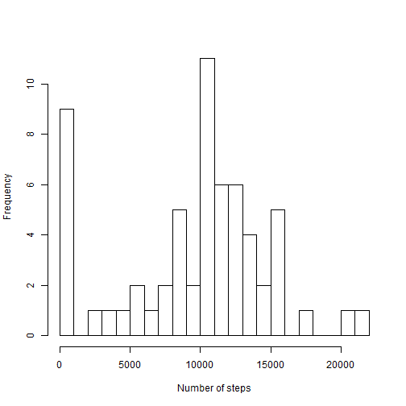
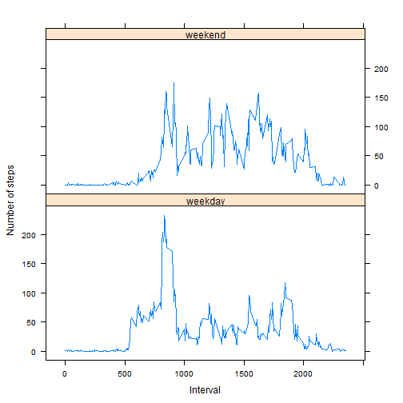

Reproducible Research - Peer Assessment 1
========================================================

## Introduction
The following analyses used activity data (n=17,568) obtained from a personal activity monitoring device (raw data is available [here](https://d396qusza40orc.cloudfront.net/repdata%2Fdata%2Factivity.zip)). The device collects data at 5 minute intervals through out the day. The data consists of two months of data from an anonymous individual collected during the months of October and November in 2012 and include the number of steps taken in 5 minute intervals each day.

## Loading and preprocessing the data

Data is loaded and preprocessed for analysis.

```r
pa <- read.csv("activity.csv")
pa$date <- as.Date(pa$date, "%Y-%m-%d")
```

## What is mean total number of steps taken per day?
Here's the histogram of the total number of steps taken per day.

```r
pa_dailytotal <- aggregate(pa[, c("steps"), drop = FALSE], list(date = pa$date), 
    sum, na.rm = TRUE)
hist(pa_dailytotal$steps, breaks = 20, main = "", xlab = "Number of steps", 
    ylab = "Frequency")
```

 

```r
pa_dailytotalmean <- mean(pa_dailytotal$steps)
pa_dailytotalmedian <- median(pa_dailytotal$steps)
```

The mean and median total number of steps taken per day are 9354.23 and 10395 respectively.
## What is the average daily activity pattern?
Here's a plot of the average number of steps taken across all days by the 5-minute interval.

```r
pa_intervalmean <- aggregate(pa[, c("steps"), drop = FALSE], list(interval = pa$interval), 
    mean, na.rm = TRUE)
plot(pa_intervalmean$interval, pa_intervalmean$steps, type = "l", main = "", 
    xlab = "Interval", ylab = "Number of steps")
```

 

```r
pa_maxintervalmean <- pa_intervalmean[pa_intervalmean$steps == max(pa_intervalmean$steps), 
    1]
```

The maximum number of steps, 206.17, occurs in the 5-minute interval that begins at 08:35.
## Imputing missing values
The presence of missing values may introduce bias into some calculations or summaries of the data.

```r
pa_countofnasteps <- sum(is.na(pa$steps))
```

In this data set, there are 2304 missing steps values across a number of days/intervals. To minimize bias the average number of steps taken across all days by the 5-minute interval is used to impute the missing steps values.
<br>
<br>
Here's the histogram of the total number of steps taken per day using the **imputed** data.

```r
pa_imputed <- pa
pa_imputed$steps <- ifelse(is.na(pa_imputed$steps), pa_intervalmean[pa_intervalmean$interval == 
    pa$interval, 2], pa$steps)
pa_dailytotal_imputed <- aggregate(pa_imputed[, c("steps"), drop = FALSE], list(date = pa$date), 
    sum, na.rm = TRUE)
hist(pa_dailytotal_imputed$steps, breaks = 20, main = "", xlab = "Number of steps", 
    ylab = "Frequency")
```

 

```r
pa_dailytotalmean_imputed <- mean(pa_dailytotal_imputed$steps)
pa_dailytotalmedian_imputed <- as.integer(median(pa_dailytotal_imputed$steps))
```

The mean and median total number of steps taken per day are 9530.72 and 10439 respectively.
<br>
<br>
Here's a table showing the mean and median total number of steps taken per day using the original and imputed data.
<br>
<table style="width:300px">
<tr>
  <td><b>Data</td>
  <td><b>Mean</td> 
  <td><b>Median</td>
</tr>
<tr>
  <td>Original</td>
  <td>9354.23</td> 
  <td>10395</td>
</tr>
<tr>
  <td>Imputed</td>
  <td>9530.72</td> 
  <td>10439</td>
</tr>
</table>
The mean total number of steps taken per day using the imputed data are larger than that using the original data, and the median total number of steps taken per day using the imputed data are larger than that using the original data.
## Are there differences in activity patterns between weekdays and weekends?
Here/'s a panel plot containing time series plots of the 5-minute interval and the average number of steps takenacross all weekday days or weekend days using the **imputed** data.

```r
pa_imputed$weekdays <- weekdays(pa_imputed$date)
pa_imputed$weekday <- as.factor(ifelse(pa_imputed$weekdays %in% c("Saturday", 
    "Sunday"), "weekend", "weekday"))
pa_intervalmean_imputed <- aggregate(pa_imputed[, c("steps"), drop = FALSE], 
    list(interval = pa_imputed$interval, weekday = pa_imputed$weekday), mean, 
    na.rm = TRUE)
library(lattice)
p <- xyplot(steps ~ interval | weekday, data = pa_intervalmean_imputed, type = "l", 
    layout = c(1, 2), main = "", xlab = "Interval", ylab = "Number of steps")
print(p)
```

 

It appears that activity, during the weekdays, is very high in morning and less so in noon, late afternoon and early evening. On the other hand, although activity is high in the morning, noon and early evening activties are equally high during the weekends. Therefore, there are clear differences in activity patterns between weekdays and weekends.
